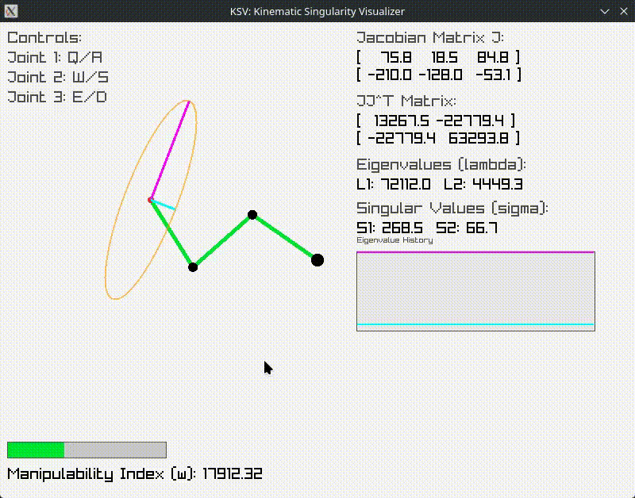

# Kinematic Singularity Visualizer (KSV)

**Experimental** visualization of robot kinematics singularities using a 3-link planar arm. Written in C with Raylib.



## Math

The project visualizes the **Manipulability Ellipsoid** derived from the Jacobian matrix $J$.

### Jacobian
For a 3-link planar arm, the Jacobian $J$ relates joint velocities $\dot{\theta}$ to end-effector velocities $\dot{x}$:

$$ \dot{x} = J(\theta)\dot{\theta} $$

### Manipulability Index
The scalar measure of manipulability $w$ is defined as:

$$ w = \sqrt{\det(JJ^T)} $$

### Ellipsoid
The shape of the manipulability ellipsoid is determined by the eigen-decomposition of $JJ^T$:

$$ JJ^T = V \Lambda V^T $$

- **Eigenvalues** ($\lambda_i$): Square of the lengths of the principal axes.
- **Eigenvectors** ($v_i$): Directions of the principal axes.

Singularities occur when $w \to 0$ or any $\lambda_i \to 0$.

## Build & Run

```console
$ cc -o nob nob.c
$ ./nob
$ ./ksv
```

## Controls

- **Q/A**: Joint 1
- **W/S**: Joint 2
- **E/D**: Joint 3

